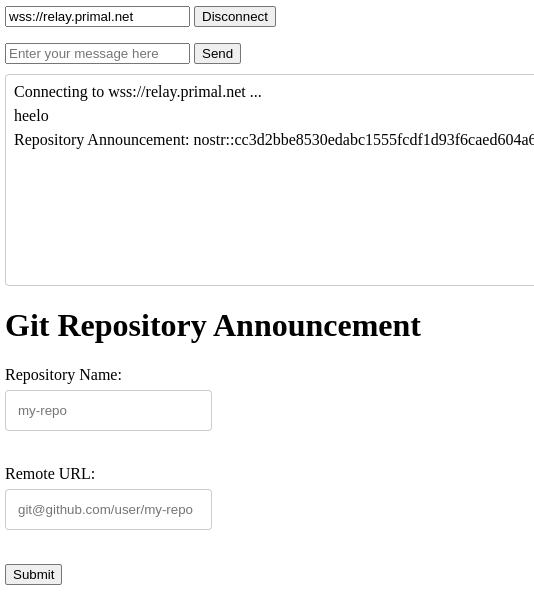

# git-remote-nostr - WIP

Host your code wherever you want (github, gitlab, gitea, etc.). 

Publish a single remote url for your repo on nostr.

## Installation

```sh
go install github.com/gugabfigueiredo/git-remote-nostr@latest
```

Clone this repo with this ad-hoc remote url:
```sh
git clone nostr::cc3d2bbe8530edabc1555fcdf1d93f6caed604a6eaf96f7939da47e83b52b935@relay.primal.net:git-remote-nostr
```

## Usage

clone a repo:
```sh
git clone nostr::cc3d2bbe8530edabc1555fcdf1d93f6caed604a6eaf96f7939da47e83b52b935@relay.primal.net:git-remote-nostr
```

Make some changes and push them back:
```sh
echo "Hello, World!" > hello.txt
git add hello.txt
git commit -m "Add hello.txt"
git push
```

### Nostr Identifiers Support

clone from a public key:
```sh
git clone nostr::cc3d2bbe8530edabc1555fcdf1d93f6caed604a6eaf96f7939da47e83b52b935@relay.primal.net:git-remote-nostr
```

Clone from a nip-05 compatible identifier:
```sh
git clone nostr::gugafigueiredo@primal.net:git-remote-nostr
```

clone from a nip-19 compatible identifier:
```sh
git clone nostr://npub1sfm59ksgc7g3sckz8hw5wk990t2v8wmunwysxn0sfpt8g7r0zezq6y46mp@relay.str/git-remote-nostr
```

## Examples

Open [the example client](examples/client.html) in a browser to create a quick bare announcement with the required tags.

Run the example client:
```sh
make example-up
```

Or connect to a known relay:



## Roadmap

- [x] create git-remote-helper
- [x] clone from remote url
- [x] fetch from remote url
- [x] push to remote url
- [x] parse remote url
- [x] fetch remote url from nostr
- [ ] add support for all nostr identifiers
  - [x] supports public keys
  - [x] full support nor nip-19 identifiers if applicable
    - [x] support nip-19 npubs/repo-id
    - [x] support nip-19 notes
    - [x] support nip-19 nevents
    - [x] support nip-19 nprofile/repo-id
    - [x] support nip-19 naddr
  - [x] supports nip-05 identifiers
  - [ ] others?
- [ ] add support for nostr hosted repos
  - [ ] add permission verification for private repos
    - [ ] add ssh key exchange for contributors